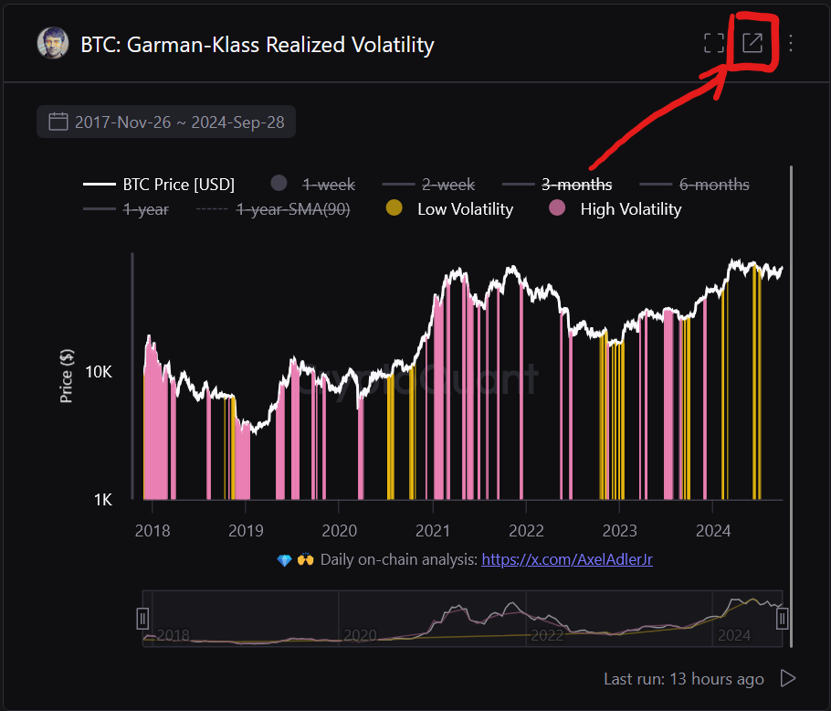

Welcome to ocfinance's documentation!
=====================================

Ocfinance is a lightweight Python library that helps developers and analysts download crypto market data directly from
supported public sources using just a URL.

It supports:

- `CheckOnChain <https://charts.checkonchain.com/>`__
- `ChainExposed <https://chainexposed.com/>`__
- `Woocharts <https://woocharts.com/>`__
- `Cryptoquant <https://cryptoquant.com/>`__
- `Bitbo Charts <https://charts.bitbo.io/index/>`__
- `Bitcoin Magazine Pro <https://www.bitcoinmagazinepro.com>`__
- `Blockchain.com <https://www.blockchain.com/explorer/charts/>`__

---

Installation
============

Install using pip:

.. code-block:: bash

    pip install ocfinance

You will need Python 3.8 or higher to use this package.

---

Usage
=====

To use `ocfinance`, all you need is the direct URL of a metric or chart from a supported site.

.. code-block:: python

    import ocfinance as of

    df = of.download(
        "https://charts.checkonchain.com/btconchain/unrealised/mvrv_all_zscore/mvrv_all_zscore_light.html",
    )

This function returns a `pandas.DataFrame` with time series data.

Example output:

.. code-block:: text

                1.5sd  1.0sd  -0.5sd  ...    Price 1.0sd  Price -0.5sd  Price -1.0sd
    Date                              ...
    2010-07-18    NaN    NaN     NaN  ...            NaN           NaN           NaN
    2010-07-19    NaN    NaN     NaN  ...            NaN           NaN           NaN
    2010-07-20    NaN    NaN     NaN  ...            NaN           NaN           NaN
    2010-07-21    NaN    NaN     NaN  ...            NaN           NaN           NaN
    2010-07-22    NaN    NaN     NaN  ...            NaN           NaN           NaN
    ...           ...    ...     ...  ...            ...           ...           ...
    2025-08-16    0.0    0.0     0.0  ...  127515.763276  71066.069382  58482.837504
    2025-08-17    0.0    0.0     0.0  ...  127558.310518  71091.341230  58504.062488
    2025-08-18    0.0    0.0     0.0  ...  127616.938695  71125.767557  58532.873812
    2025-08-19    0.0    0.0     0.0  ...  127713.177446  71181.632875  58579.459251
    2025-08-20    0.0    0.0     0.0  ...  127717.341892  71186.181907  58583.814095

---

Supported Sources
=================

Ocfinance supports URLs from the following public sources:

CheckOnChain (`charts.checkonchain.com <https://charts.checkonchain.com>`__)
----------------------------------------------------------------------------

Example:

.. code-block:: python

    url = "https://charts.checkonchain.com/btconchain/unrealised/mvrv_all_zscore/mvrv_all_zscore_light.html"
    df = of.download(url)

ChainExposed (`chainexposed.com <https://chainexposed.com/>`__)
---------------------------------------------------------------

Example:

.. code-block:: python

    url = "https://chainexposed.com/NUPL.html"
    df = of.download(url)

WooCharts (`woocharts.com <https://woocharts.com/>`__)
------------------------------------------------------

Example:

.. code-block:: python

    url = "https://woocharts.com/bitcoin-price-models/"
    df = of.download(url)

Cryptoquant (`cryptoquant.com <https://cryptoquant.com/>`__)
------------------------------------------------------------

.. note:: Cryptoquant requires your account email and password to access the data.

.. code-block:: python

    import os
    import ocfinance as of

    # Setup environment variables
    email = os.getenv('CRYPTOQUANT_EMAIL')
    password = os.getenv('CRYPTOQUANT_PASSWORD')

    # Download the data
    data = of.download(
        "https://cryptoquant.com/analytics/query/66451fd6f3cac64b85386229?v=66451fd6f3cac64b8538622b",
        email=email,
        password=password
    )

To obtain the URL for a specific metric, navigate to the desired chart on Cryptoquant and click the "Share" button.
Copy the URL from the address bar.

.. image:: ../assets/cryptoquant_step2.png

Bitbo Charts (`charts.bitbo.io <https://charts.bitbo.io/index/>`__)
-------------------------------------------------------------------

Example:

.. code-block:: python

    url = "https://charts.bitbo.io/long-term-power-law/"
    df = of.download(url)

Bitcoin Magazine Pro (`bitcoinmagazinepro.com <https://www.bitcoinmagazinepro.com>`__)
--------------------------------------------------------------------------------------

Example:

.. code-block:: python

    url = "https://www.bitcoinmagazinepro.com/charts/puell-multiple/"
    df = of.download(url)

Blockchain.com (`blockchain.com <https://www.blockchain.com/explorer/charts/>`__)
---------------------------------------------------------------------------------

TODO: timeframe, etc.

Example:

.. code-block:: python

    url = "https://www.blockchain.com/explorer/charts/market-price"
    df = of.download(url)

---

Optional Arguments
==================

You can filter the data by date using:

- `start` (str): Starting date, format `"YYYY-MM-DD"`
- `end` (str): Ending date, format `"YYYY-MM-DD"`

If no dates are provided, the full available history is returned.

---

Error Handling
==============

If the URL is invalid or from an unsupported domain, an exception will be raised:

.. code-block:: python

    ocfinance.download("https://unsupported-domain.com")
    # Raises ValueError: Unsupported source

---

Contributing
============

We welcome contributions! To add support for a new data source:

1. Create a new scraper module in `ocfinance/sources/`
2. Add a URL pattern matcher in `ocfinance/download.py`
3. Add tests and add documentation
4. Submit a pull request

---

License
=======

Ocfinance is released under the MIT License.
